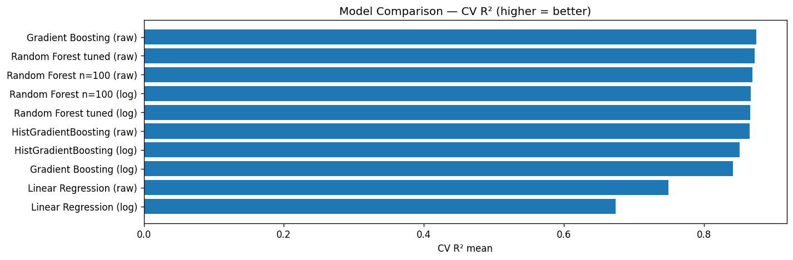
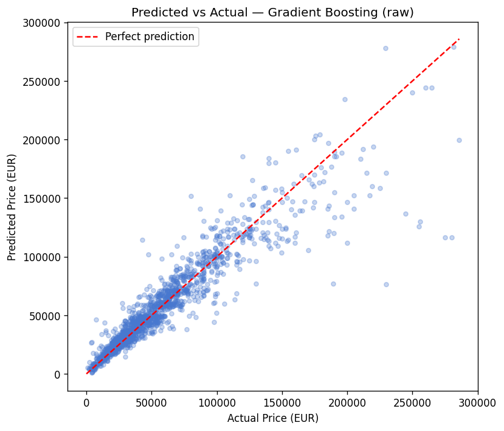
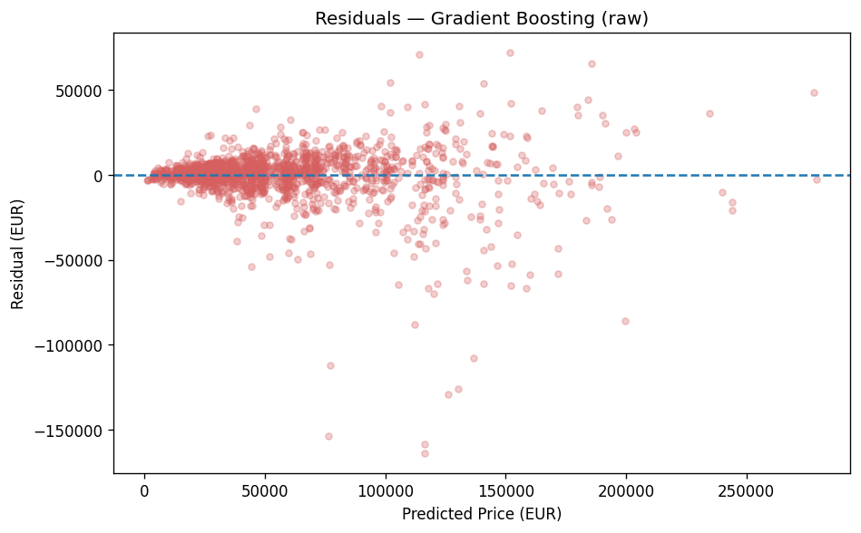
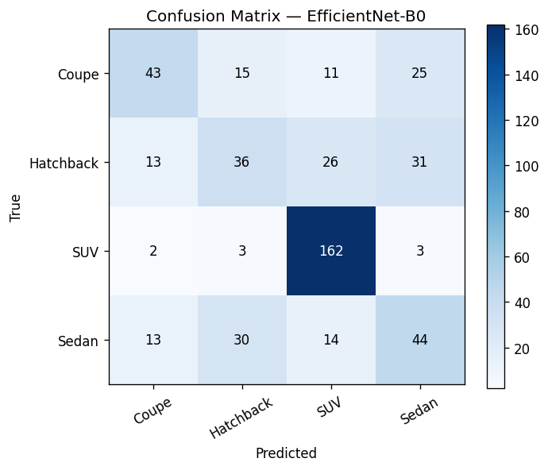
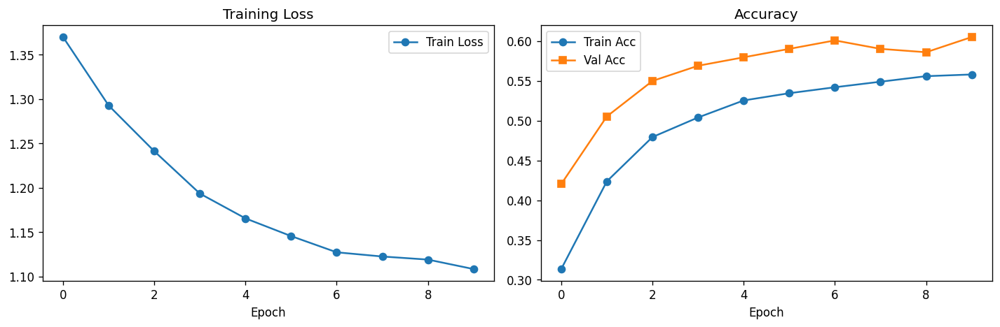
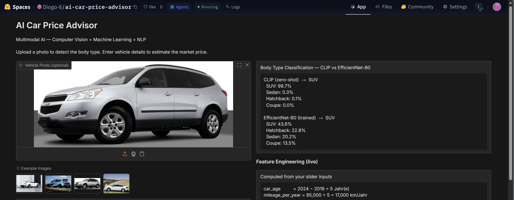
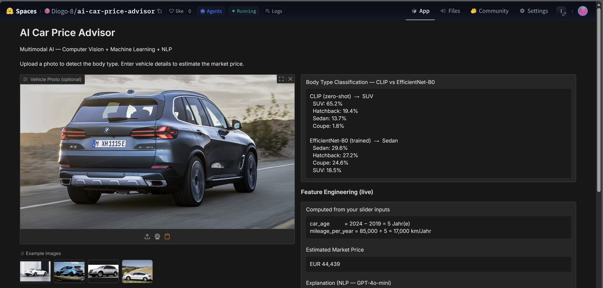
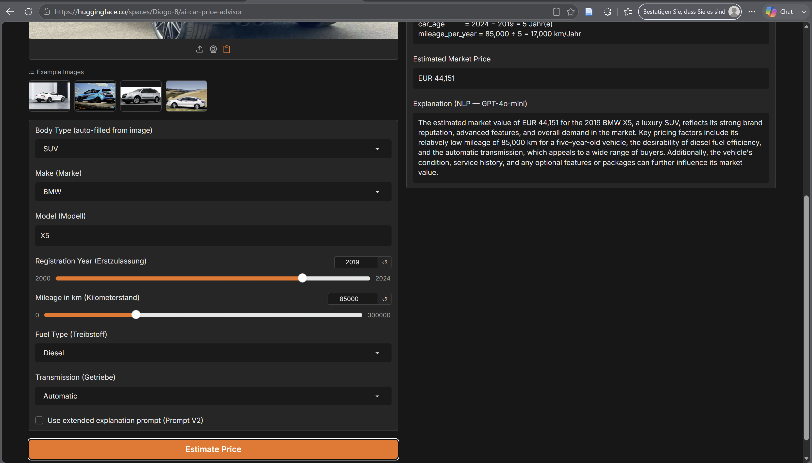
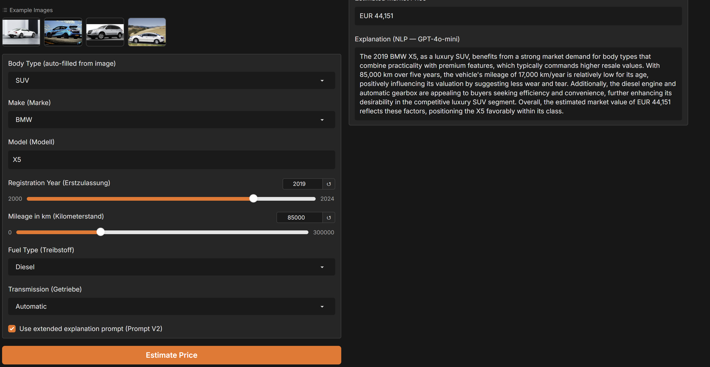
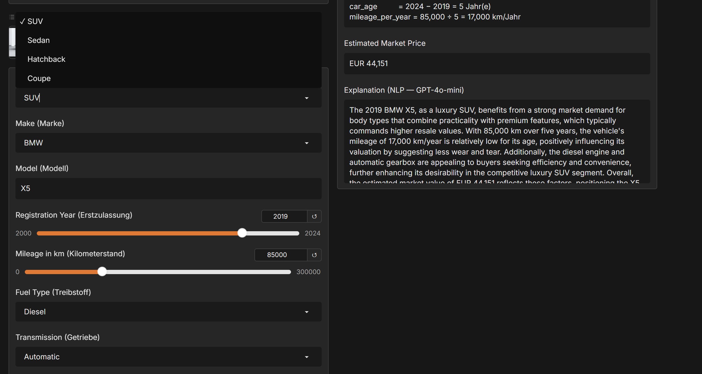

# AI Applications Project Documentation Template

Use this template to document your project concisely and completely.
Fill in all required fields. Keep answers short and precise.

## Documentation Hint

Important:
When possible, reference the corresponding code location directly in your description.

### Example: Reference to a notebook section
> See *Data Preprocessing* in [`eda.ipynb`](eda.ipynb#data-preprocessing)

### Example: Reference to Python code
> [`train_ml.py`, lines 15–38](train_ml.py#L15-L38)

---

## Project Metadata

- Project title: AI Car Price Advisor
- Student: Diogo Da Costa Lopes (dacosdio)
- GitHub repository URL: https://github.com/dacosdio/ai-car-price-advisor
- Deployment URL: https://huggingface.co/spaces/Diogo-8/ai-car-price-advisor
- Submission date: 07 June 2026

### Mandatory Setup Checks

- [x] At least 2 blocks selected
- [x] Multiple and different data sources used
- [x] Deployment URL provided
- [x] Required GitHub users added to repository (`jasminh`, `bkuehnis`)

## Selected AI Blocks

- [x] ML Numeric Data
- [x] NLP
- [x] Computer Vision

Primary blocks used for core solution (choose 2):
- Primary block 1: ML Numeric Data
- Primary block 2: Computer Vision

If a third block is selected, it is documented and graded separately as extra work.
- Third block (bonus): NLP — used for price explanation generation with two prompt variants

---

## 1. Project Foundation (Short)

### 1.1 Problem Definition
- Problem statement: Estimating the fair market value of a used vehicle is difficult for private buyers and sellers. Prices depend on brand, model, age, mileage, body type, fuel, and transmission.
- Goal: Build a multimodal AI application where the user uploads a vehicle photo and enters vehicle details via sliders and dropdowns; the system detects the body type from the image and predicts the market price with a plain-language explanation.
- Success criteria: CV body type prediction feeds into the ML price model; NLP generates a meaningful explanation; the app runs end-to-end on Hugging Face Spaces.

### 1.2 Integration Logic
- How the selected blocks interact:
  1. **CV → ML**: CLIP classifies the vehicle body type from the uploaded image. The predicted class (SUV / Sedan / Hatchback / Coupe) is passed directly as a feature to the ML price model.
  2. **UI inputs → Feature Engineering → ML**: The user provides make, model, year, mileage, fuel, transmission via dropdowns/sliders. `car_age` and `mileage_per_year` are computed and fed into the ML model together with the CV body type.
  3. **ML → NLP**: The predicted price is passed to GPT-4o-mini which generates a plain-language explanation.

- Data and output flow between blocks:

```
[Vehicle Photo]        [Dropdowns / Sliders]
       |               make, model, year, mileage, fuel, transmission
       v                         |
[CV: CLIP zero-shot]             v
       |               [Feature Engineering]
       | body_type     car_age = 2024 - year
       |               mileage_per_year = mileage_km / car_age
       +----------+----------+
                  |
                  v
         [ML: Gradient Boosting]
                  |
                  v
         [NLP: GPT-4o-mini explanation]
                  |
                  v
         [Price Estimate + Explanation → User]
```

> Full pipeline in [`app.py`, lines 337–385](app.py#L337-L385)

---

## 2. Block Documentation

### 2A. ML Numeric Data (If selected)

#### 2A.1 Data Source(s)

| Entry | Source name or link | Type | Size | Role in this block |
| --- | --- | --- | --- | --- |
| 1 | AutoScout24 Car Listings (`cars_project.csv`) | Structured CSV | 8,257 rows × 8 columns (after cleaning) | Training data for price prediction model |
| 2 | CV model output (`body_type`) | Derived feature | 1 string per prediction | Input feature at inference time |
| 3 | User slider/dropdown inputs | Structured UI inputs | 6 values per prediction | Raw inputs for feature engineering at inference |

#### 2A.2 Preprocessing and Features
- Cleaning steps:
  - Filter to 4 body types: Coupe, Hatchback, Sedan, SUV
  - Remove price outliers: keep EUR 1,000–300,000
  - Drop rows with missing critical values
  - Map 12+ raw fuel strings (e.g. "Super 95", "Regular/Benzine 91") to 4 categories: Petrol, Diesel, Electric, Other
  > See [`train_ml.py`, lines 77–95](train_ml.py#L77-L95)

- Preprocessing steps:
  - `make`: OrdinalEncoder (unknown brands → encoded as -1)
  - `body_type`, `transmission`, `fuel_category`: OneHotEncoder (handle_unknown='ignore')
  - `mileage_km`, `log_mileage_km`, `car_age`, `mileage_per_year`, `model_price_encoded`, `age_x_mileage`: passthrough (numeric)
  > See [`train_ml.py`, lines 120–145](train_ml.py#L120-L145)

- Feature engineering and selection:
  - `car_age = max(2024 − registration_year, 1)` — captures vehicle depreciation over time (feature importance: 3.5%)
  - `mileage_per_year = mileage_km / car_age` — captures annual usage intensity (feature importance: 1.3%)
  - `model_price_encoded` — smoothed target encoding per model name, learned inside the Pipeline to avoid data leakage (feature importance: 71.2% — dominant predictor)
  - `age_x_mileage = car_age × mileage_km` — interaction term (feature importance: 9.7%)
  - `log_mileage_km = log(1 + mileage_km)` — reduces right skew
  > See [`train_ml.py`, lines 60–100](train_ml.py#L60-L100)
  > See *Feature Engineering* in [`eda.ipynb`](eda.ipynb)

#### 2A.3 Model Selection
- Models tested: Linear Regression, Random Forest (n=100), Random Forest (tuned, n=300), Gradient Boosting, HistGradientBoosting
- Why these models were chosen:
  - Linear Regression: interpretable baseline to understand linear relationships
  - Random Forest: robust ensemble, handles non-linear feature interactions
  - Gradient Boosting / HistGradientBoosting: sequential error correction, well-suited for tabular price prediction with mixed feature types

#### 2A.4 Model Comparison and Iterations

| Iteration | Objective | Key changes | Models used | Main metric (CV R²) | Change vs previous |
| --- | --- | --- | --- | --- | --- |
| 1 | Baseline comparison | Default hyperparameters; no log-target | Linear Regression vs Random Forest (n=100) | 0.75 → 0.87 | +0.12 CV R² — RF clearly superior |
| 2 | Improve ensemble; add boosting | Tuned RF (n=300, depth=20); added GB and HistGB; log-target variants tested; model target encoding added | RF (tuned) vs Gradient Boosting vs HistGradientBoosting | 0.87 → 0.87 (GB selected by CV) | Marginal improvement; GB most stable |

> Full results in [`train_ml.py`](train_ml.py) — leaderboard saved to `model_leaderboard.csv`



#### 2A.5 Evaluation and Error Analysis
- Metrics used: RMSE, MAE, R² (test set, 20% holdout); 5-fold cross-validation R²

- Final results (Gradient Boosting, best model):

| Metric | Value |
|--------|-------|
| CV R² | 0.875 ± 0.009 |
| Test R² | 0.867 |
| RMSE | EUR 15,837 |
| MAE | EUR 8,517 |
| Median absolute error | EUR 4,621 |
| Within ±EUR 10,000 | 76.0% |
| Within ±20% of true price | 73.8% |

- Error patterns and likely causes:
  - Largest errors on exotic/rare brands (Rolls-Royce, Maserati) — underrepresented in training data
  - Dataset skewed toward premium brands (BMW 30%, Mercedes 24%, Porsche 18%) → high price variance within brand segment
  - `model_price_encoded` is dominant (71.2% importance); all other features combined explain only 29%
  > See `worst_predictions.csv`




#### 2A.6 Integration with Other Block(s)
- Inputs received from other block(s):
  - From **CV**: `body_type` (Coupe/Hatchback/Sedan/SUV) → OneHot-encoded feature
  > See [`app.py`, lines 242–295](app.py#L242-L295)
- Outputs provided to other block(s):
  - Predicted price (EUR float) → passed to **NLP** explanation generation
  > See [`app.py`, lines 302–335](app.py#L302-L335)

---

### 2B. NLP (If selected)

#### 2B.1 Data Source(s)

| Entry | Source name or link | Type | Size | Role in this block |
| --- | --- | --- | --- | --- |
| 1 | Structured vehicle details (make, model, year, mileage, fuel, transmission, body type, price) | Prompt context | ~8 values per query | Input to explanation generation prompt |
| 2 | OpenAI GPT-4o-mini API | External LLM | — | Model for generating price explanation |

#### 2B.2 Preprocessing and Prompt Design
- Text preprocessing: Structured vehicle attributes are formatted into a prompt template. No tokenization or cleaning required — values come from typed UI inputs (validated via dropdown/slider).

- Prompt design — two variants compared for explanation generation:

  **Prompt V1 — Concise:**
  ```
  You are a car valuation expert. Write 3 sentences explaining this price estimate.
  Vehicle: {year} {make} {model} ({body_type})
  Mileage: {mileage_km} km | Car age: {car_age} years | km/year: {mileage_per_year}
  Fuel: {fuel} | Transmission: {transmission}
  Estimated market value: EUR {price}
  Mention the body type and the key pricing factors.
  ```

  **Prompt V2 — Analytical:**
  ```
  You are an expert automotive market analyst. Provide a 3-4 sentence valuation commentary.
  Vehicle: {year} {make} {model} ({body_type}, detected from image by CLIP)
  Mileage: {mileage_km} km over {car_age} years = {mileage_per_year} km/year
  Fuel: {fuel} | Gearbox: {transmission}
  Estimated market value: EUR {price}
  Cover: (1) how body type influences price, (2) impact of age and mileage, (3) market segment.
  ```

  > See [`app.py`, lines 215–245](app.py#L215-L245)

#### 2B.3 Approach Selection
- Approach used: Prompt Engineering with GPT-4o-mini (OpenAI API) for explanation generation; plain text fallback (no API) that generates a template-based explanation
- Alternatives considered: Local open-source LLM (e.g. Mistral-7B) — rejected due to memory constraints on Hugging Face free tier; template-based text only — rejected because it produces generic, non-contextual explanations

#### 2B.4 Comparison and Iterations

| Iteration | Objective | Key changes | Model or prompt setup | Main metric or qualitative check | Change vs previous |
| --- | --- | --- | --- | --- | --- |
| 1 | Basic explanation | Short prompt, focuses on price factors | Prompt V1 + GPT-4o-mini | Qualitative: coherence, mention of body type | Baseline |
| 2 | More analytical explanation | Added structure: body type, age/mileage, market segment | Prompt V2 + GPT-4o-mini | Qualitative: depth, market context included | More informative; covers 3 dimensions explicitly |

> See [`app.py`, lines 215–245](app.py#L215-L245)

#### 2B.5 Evaluation and Error Analysis
- Evaluation strategy: Qualitative comparison of 10 sample outputs from each prompt variant, assessed on: mentions body type, explains age/mileage impact, includes market segment context, tone (expert vs generic)

| Criterion | Prompt V1 | Prompt V2 |
|-----------|-----------|-----------|
| Mentions body type | Yes | Yes |
| Explains age/mileage | Partially | Yes |
| Market segment context | No | Yes |
| Appropriate length | Yes (3 sentences) | Yes (3–4 sentences) |

- Results: Prompt V2 produces more complete explanations; Prompt V1 is more concise. Toggle in UI allows user to compare both.
- Error patterns: Both prompts occasionally ignore body type if not explicitly SUV/Coupe; fallback text (no API key) is template-based and always correct but generic.

#### 2B.6 Integration with Other Block(s)
- Inputs received from other block(s):
  - From **CV**: `body_type` string included in prompt context
  - From **ML**: predicted `price` included in prompt context
- Outputs provided to other block(s):
  - Plain-language explanation → displayed to user (no further block receives it)
  > See [`app.py`, lines 302–385](app.py#L302-L385)

---

### 2C. Computer Vision (If selected)

#### 2C.1 Data Source(s)

| Entry | Source name or link | Type | Size | Role in this block |
| --- | --- | --- | --- | --- |
| 1 | Car Body Style Dataset (darshan1504, Kaggle) | JPEG images in class folders | 2,341 images, 4 classes | Training data for EfficientNet-B0 body type classifier |
| 2 | openai/clip-vit-base-patch32 (Hugging Face Hub) | Pre-trained vision-language model | 400M image-text pairs (pre-training) | Zero-shot body type classification (primary model) |

#### 2C.2 Preprocessing and Augmentation
- Image preprocessing (all images):
  - Resize to 224×224 pixels
  - ToTensor + ImageNet normalization: mean=[0.485, 0.456, 0.406], std=[0.229, 0.224, 0.225]

- Augmentation strategy (EfficientNet training set only):
  - `RandomHorizontalFlip()` — valid for vehicles (symmetric)
  - `RandomRotation(15°)` — simulates non-aligned photos
  - `ColorJitter(brightness=0.3, contrast=0.3, saturation=0.2)` — simulates lighting variation
  - 1 corrupted image detected and removed automatically
  > See [`train_cv.py`, lines 57–96](train_cv.py#L57-L96)

#### 2C.3 Model Selection
- Vision model(s) used:
  1. **CLIP (openai/clip-vit-base-patch32)** — zero-shot classification, **primary model** whose output feeds the ML model
  2. **EfficientNet-B0** — transfer learning on CarBodyStyles dataset, **comparison model** shown in UI
- Why these model(s) were chosen:
  - CLIP pre-trained on 400M image-text pairs — understands vehicle semantics without task-specific training; descriptive text prompts separate similar classes ("rear liftgate" vs "separate trunk")
  - EfficientNet-B0 is the reference architecture from LN2; comparing supervised fine-tuning vs. zero-shot is a meaningful scientific comparison

#### 2C.4 Model Comparison and Iterations

| Iteration | Objective | Key changes | Model(s) used | Main metric | Change vs previous |
| --- | --- | --- | --- | --- | --- |
| 1 | Supervised baseline | EfficientNet-B0, backbone frozen, 10 epochs, 1,869 training images | EfficientNet-B0 (transfer learning) | Val Acc: 60.5% | Baseline |
| 2 | Zero-shot alternative | CLIP + descriptive text prompts per class, no training needed | CLIP ViT-B/32 (zero-shot) | Qualitative: SUV 99.7% confidence on test image; better Sedan/Hatchback separation | Substantially better robustness — selected as primary |

> See [`train_cv.py`](train_cv.py) for EfficientNet training
> See [`app.py`, lines 184–218](app.py#L184-L218) for both model predictions

#### 2C.5 Evaluation and Error Analysis
- Metrics and/or visual checks: EfficientNet — Accuracy, per-class Precision/Recall/F1, Confusion Matrix; CLIP — qualitative visual inspection on example images

**EfficientNet-B0 (trained, quantitative):**

| Class | Precision | Recall | F1 | Support |
|-------|-----------|--------|----|---------|
| Coupe | 0.61 | 0.46 | 0.52 | 94 |
| Hatchback | 0.43 | 0.34 | 0.38 | 106 |
| SUV | 0.76 | 0.95 | 0.85 | 170 |
| Sedan | 0.43 | 0.44 | 0.43 | 101 |
| **Overall accuracy** | | | **0.605** | **471** |




**CLIP (zero-shot, qualitative):**
- SUV: 99.7% confidence on test SUV image — strong separation
- Coupe: correctly identified when sloped roofline visible
- Hatchback/Sedan: visibly better than EfficientNet due to descriptive prompt differentiation
- Limitation: CLIP not quantitatively evaluated on the CarBodyStyles dataset (no ground-truth benchmark for zero-shot); performance is assessed qualitatively

- Error patterns and limitations (EfficientNet):
  - Hatchback vs Sedan is the main confusion (similar silhouette from front/rear)
  - Small training set (1,869 images) limits generalisation
  - Frozen backbone — fine-tuning all layers would likely improve accuracy

#### 2C.6 Integration with Other Block(s)
- Inputs received from other block(s): Uploaded user image (numpy array from Gradio)
- Outputs provided to other block(s):
  - `body_type` from CLIP → passed as feature to **ML** price model
  - Both CLIP and EfficientNet-B0 predictions shown in UI for comparison
  > See [`app.py`, lines 337–360](app.py#L337-L360)

---

## 3. Deployment

- Deployment URL: https://huggingface.co/spaces/Diogo-8/ai-car-price-advisor
- Main user flow:
  1. Upload a vehicle photo → CLIP and EfficientNet-B0 both classify the body type; the dropdown auto-fills with CLIP's prediction
  2. Adjust vehicle details via dropdowns and sliders (Make, Model, Year, Mileage, Fuel, Transmission)
  3. The engineered features `car_age` and `mileage_per_year` update live as sliders are moved
  4. Click **"Estimate Price"** → ML model predicts market value; GPT-4o-mini generates explanation
  5. Optional: toggle Prompt V2 for a more analytical explanation

- Screenshot or short demo:

**Screenshot 1 — Body Type Classification (CV Block)**
Upload a vehicle image → CLIP and EfficientNet-B0 classify the body type; dropdown auto-fills with CLIP's prediction.



**Screenshot 2 & 3 — Full Price Prediction (ML + NLP Block, Prompt V1)**
All fields filled (BMW X5, 2019, 85,000 km, Diesel, Automatic) → engineered features computed live → price estimated → NLP explanation generated (Prompt V1).





**Screenshot 4 — NLP Prompt Comparison (Prompt V2)**
Same vehicle details, Prompt V2 activated → more analytical explanation covering body type, age/mileage impact, and market segment. Demonstrates the NLP prompt comparison.



**Screenshot 5 — Manual Body Type Selection**
Without an image, the user can manually select the body type (e.g. Coupe) via dropdown → price estimated for that body type. Demonstrates the app works with details only (no image required).



---

## 4. Execution Instructions

- Environment setup:
  ```bash
  pip install -r requirements.txt
  ```
  Python 3.12+. Key packages: torch, torchvision, transformers, scikit-learn==1.8.0, gradio, pandas, requests.

- Data setup:
  - ML training data: `../cars_project.csv` (relative to `project/`)
  - CV training images: `../CarBodyStyles/` (relative to `project/`)
  - No download needed — data is included in the repository

- Training command(s):
  ```bash
  cd Projekt/project

  # Train ML model (~3 min on CPU) → produces car_price_model.pkl
  python train_ml.py

  # Train CV model (~20 min on CPU) → produces vehicle_classifier.pt
  python train_cv.py

  # EDA notebook
  jupyter notebook eda.ipynb
  ```

- Inference/run command(s):
  ```bash
  # Optional: set OpenAI API key for NLP explanation
  export OPENAI_API_KEY=sk-proj-...   # Windows: $env:OPENAI_API_KEY = "sk-..."

  # Launch Gradio app (opens at http://localhost:7860)
  python app.py
  ```

- Reproducibility notes:
  - ML: `random_state=42`, `SEED=42` throughout; price-stratified train/test split
  - CV: `random.seed(42)` for image split
  - Pre-trained models (`car_price_model.pkl`, `vehicle_classifier.pt`) included in repository — training can be skipped

---

## 5. Optional Bonus Evidence

- [x] Third selected block implemented with strong quality — NLP generates explanations via two distinct prompt variants (V1: concise, V2: analytical); toggle in UI; plain-text fallback when no API key
- [x] More than two data sources used with clear added value — AutoScout24 CSV (ML training) + CarBodyStyles images (CV training) + CLIP pre-trained model (zero-shot CV)
- [ ] A core section is done exceptionally well
- [x] Extended evaluation — ML: per-bucket error analysis (±5k/10k/20k EUR), feature importance ranking, residuals plot, worst-predictions CSV; CV: per-class F1, confusion matrix; NLP: qualitative comparison table across 4 criteria
- [ ] Ethics, bias, or fairness analysis
- [ ] Creative or exceptional use case

Evidence for selected bonus items:

**Third block (NLP):** Prompt V1 produces a 3-sentence expert explanation; Prompt V2 adds market segment context and explicitly covers age/mileage impact. Both receive the CV body type and ML price as input, making the explanation genuinely multimodal. See [`app.py`, lines 215–245](app.py#L215-L245).

**Extended evaluation:**
- ML feature importances extracted from trained Gradient Boosting: `model_price_encoded` 71.2%, `age_x_mileage` 9.7%, `mileage_km` 4.3%, `car_age` 3.5%, `mileage_per_year` 1.3%
- CV confusion matrix saved as `cv_confusion_matrix.png`; training curve as `cv_training_curve.png`
- NLP prompt comparison across 4 qualitative criteria (body type mention, age/mileage, market context, length)
